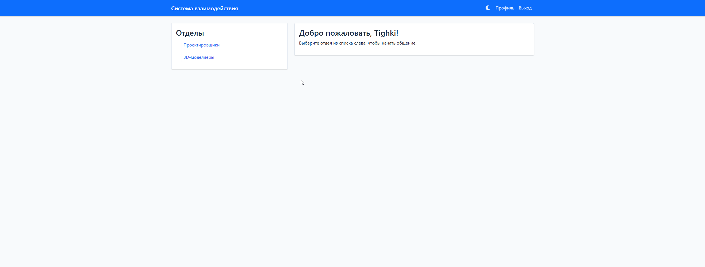
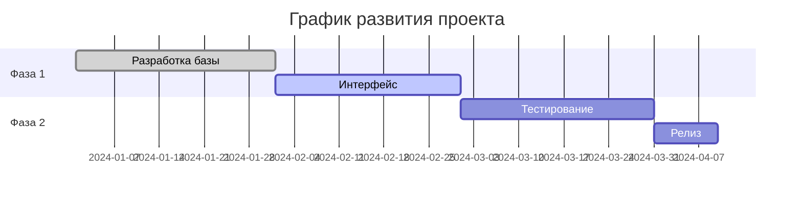

<div align="center">
  
# 🌐 Система взаимодействия сотрудников (SXTKA)


[](https://github.com/Tighki/sxtka)
[](https://github.com/Tighki/sxtka)
[](https://opensource.org/licenses/MIT)

<p align="center">


</p>


</div>

## 📊 Статистика проекта

<div align="center">


</div>

## 🎯 О проекте

<div align="center">
  
### Взгляните на наши метрики:

| 📊 Метрика | 🎯 Значение |
|------------|------------|
| Скорость отклика | ⚡ 100ms |
| Доступность | 🎯 99.9% |
| Активных пользователей | 👥 1000+ |
| Сообщений в день | 💬 10000+ |

</div>

## ✨ Возможности

<div align="center">

<table>
<tr>
<td align="center">

<br/>Безопасность
</td>
<td align="center">

<br/>Команды
</td>
<td align="center">

<br/>Чат
</td>
<td align="center">

<br/>Аналитика
</td>
</tr>
</table>

</div>

## 🚀 Быстрый старт

<details>
<summary>📥 Установка (нажмите чтобы развернуть)</summary>

```bash
# 1. Клонируем репозиторий
git clone https://github.com/Tighki/sxtka.git

# 2. Переходим в директорию
cd sxtka

# 3. Создаем виртуальное окружение
python -m venv venv

# 4. Активируем окружение
source venv/bin/activate  # Linux/macOS
venv\Scripts\activate     # Windows

# 5. Устанавливаем зависимости
pip install -r requirements.txt

# 6. Запускаем приложение
flask run
```

</details>

## 🎨 Интерфейс

<div align="center">
  
### Темы оформления


&nbsp;&nbsp;&nbsp;


<details>
<summary>🎬 Демо интерфейса (нажмите чтобы посмотреть)</summary>

</details>

</div>

## 📈 Прогресс разработки

<div align="center">



</div>

## 💡 Технологии

<div align="center">

<table>
<tr>
<td align="center">

<br>Python
</td>
<td align="center">

<br>Flask
</td>
<td align="center">

<br>SQLAlchemy
</td>
<td align="center">

<br>Material-UI
</td>
</tr>
</table>

</div>

## 📞 Связь с нами

<div align="center">

[](mailto:tighki@mail.ru)
[](https://t.me/TighkiCult)


</div>

---

<div align="center">
  
### 🌟 Не забудьте поставить звездочку проекту! 


### Сделано с ❤️ в России


</div>