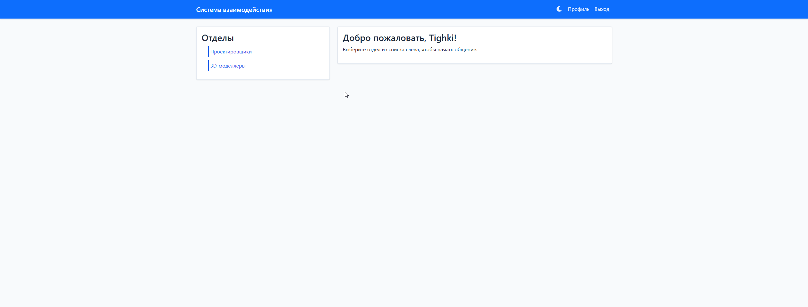
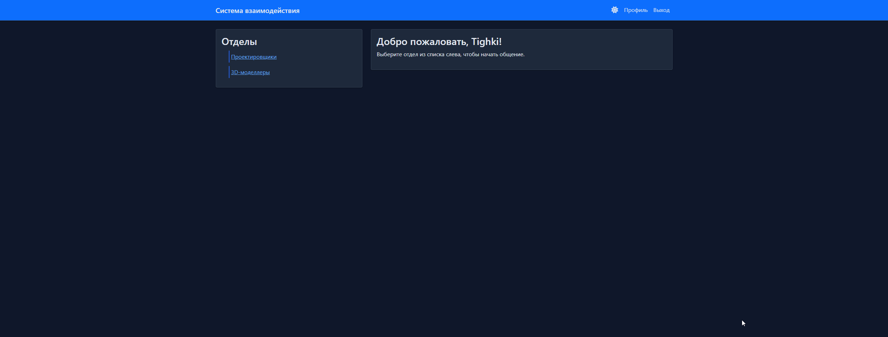

# 🌐 Система взаимодействия сотрудников

<div align="center">


</div>

## 📋 Описание

Веб-приложение для организации эффективного взаимодействия сотрудников различных структурных подразделений. Система предоставляет удобный интерфейс для общения, обмена информацией и управления отделами.

### ✨ Основные возможности

- 🔐 **Аутентификация пользователей**
  - Регистрация новых сотрудников
  - Вход в систему
  - Восстановление пароля

- 👥 **Управление отделами**
  - Создание и редактирование отделов
  - Иерархическая структура
  - Назначение руководителей

- 💬 **Чат между сотрудниками**
  - Общение в реальном времени
  - История сообщений
  - Уведомления

- 🎨 **Персонализация**
  - Темная/светлая тема
  - Настройка профиля
  - Управление уведомлениями

- 👨‍💼 **Административная панель**
  - Управление пользователями
  - Мониторинг активности
  - Системные настройки

## 🚀 Технологии

<div align="center">

| Технология | Описание |
|------------|-----------|
| Python | Основной язык разработки |
| Flask | Веб-фреймворк |
| SQLAlchemy | ORM для работы с БД |
| Socket.IO | Реализация чата |
| Material-UI | Компоненты интерфейса |
| SQLite | База данных |

</div>

## 📦 Установка

1. **Клонирование репозитория**
```bash
git clone https://github.com/your-username/employee-interaction-system.git
cd employee-interaction-system
```

2. **Создание виртуального окружения**
```bash
python -m venv venv
source venv/bin/activate  # Linux/macOS
venv\Scripts\activate     # Windows
```

3. **Установка зависимостей**
```bash
pip install -r requirements.txt
```

4. **Настройка переменных окружения**
```bash
cp .env.example .env
# Отредактируйте .env файл, установив необходимые значения
```

5. **Инициализация базы данных**
```bash
flask db upgrade
```

6. **Запуск приложения**
```bash
flask run
```

## 🔧 Конфигурация

Основные настройки приложения находятся в файле `.env`:

```env
FLASK_APP=app.py
FLASK_ENV=development
SECRET_KEY=your-secret-key
DATABASE_URL=sqlite:///app.db
MAIL_SERVER=smtp.gmail.com
MAIL_PORT=587
MAIL_USE_TLS=true
MAIL_USERNAME=your-email@gmail.com
MAIL_PASSWORD=your-email-password
```

## 👥 Роли пользователей

| Роль | Возможности |
|------|-------------|
| Администратор | Полный доступ ко всем функциям системы |
| Руководитель отдела | Управление своим отделом и сотрудниками |
| Сотрудник | Базовый функционал общения и работы |

## 📱 Скриншоты

<div align="center">

| Светлая тема | Темная тема |
|--------------|-------------|
|  |  |

</div>

## 📞 Контакты

- **Разработчик**: Vlad
- **Email**: tighki@mail.ru
- **Telegram**: @TighkiCult

<div align="center">


### Сделано с ❤️ в России

</div> 